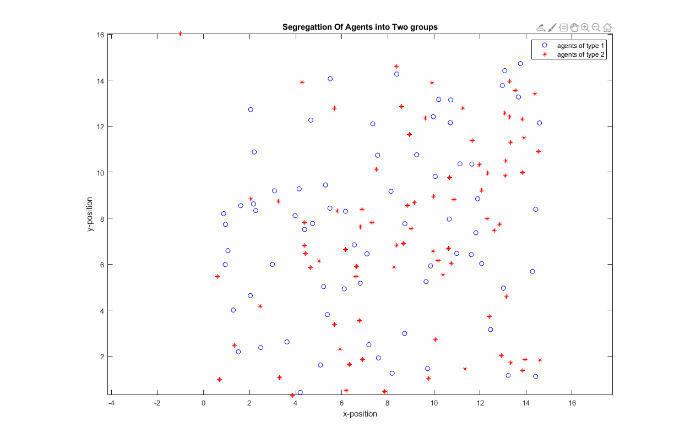

# Segregation-And-Flocking-of-Heterogeneous-Robotic-Swarms-With-Potential-Field
Implementation of the paper "Segregation of Heterogeneous Units in a Swarm of Robotic Agents" Authors-Manish Kumar; Devendra P. Garg; Vijay Kumar

The concept of Artificial Potential Field has been studied for the application to the segregation and flocking of a group of robotic agents.
# Segregarion
Simply Means to keep one thing separate from another or dividing into groups.
# Flocking 
Flocking is the behaviour which can be seen in the birds. it means is to fly or move with a specified formation while maintaing a constant velocity which ramains equal for all the agents.
# Results
## Segregation Into Two Groups

 ## Segregation into Mutliple Groups

